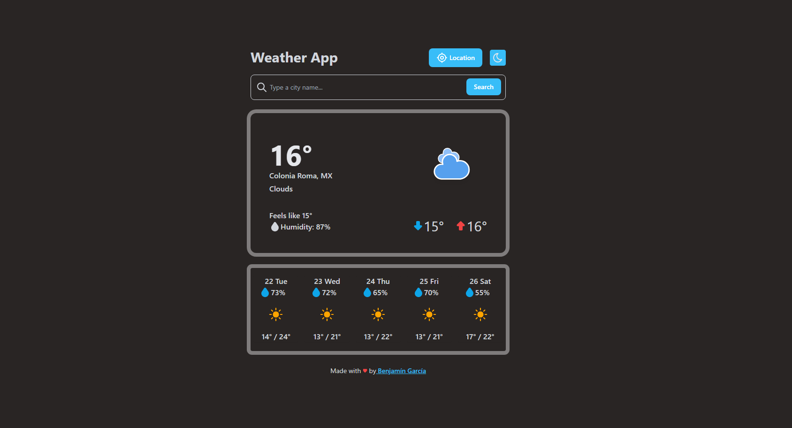

# Weather App ⛅
Simple weather application developed with the objective of implementing basic Typescript knowledge.  
In this project we will work with a search field to type the name of the city you want to visualize and also with a button that will request access to your location to show the weather of your current location.  

## Start 🚀
```
git clone https://github.com/Benjamngarcia/weather-app.git
cd/weather-app
npm install
```
Create your .env file and put your OpenWeatherMap API_KEY as in .env.example:

```
VITE_APP_API_KEY=
```
Run project:
```
npm run dev
```
Open the browser in: [http://localhost:5173/](http://localhost:5173/)
## Tech stack 🛠️
The realization of this project was made possible by the use of technologies like:


## Deploy 📦
The project is deployed in Vercel, you can see it running at: []()


Made with 💙 by [Benjamín García](https://benjamngarcia.me/)
